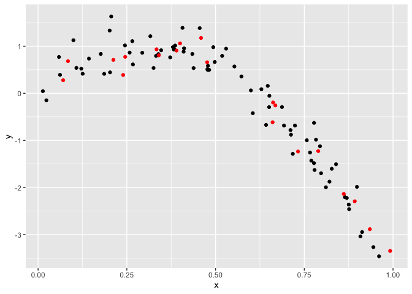
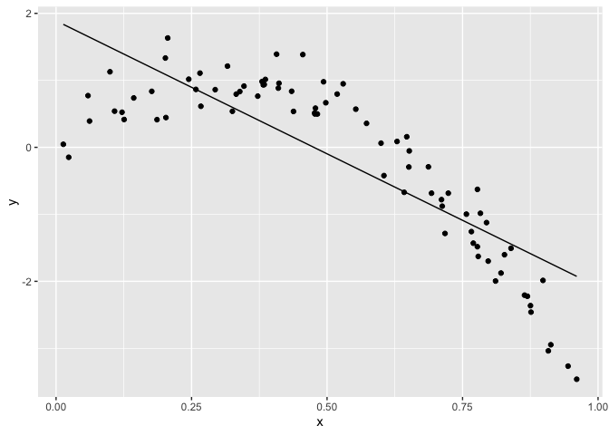
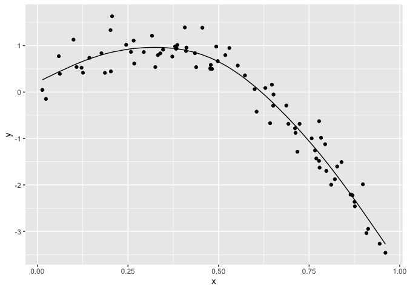
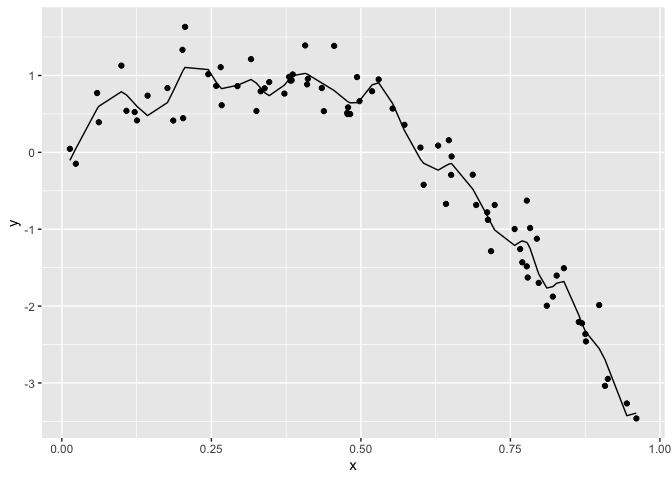
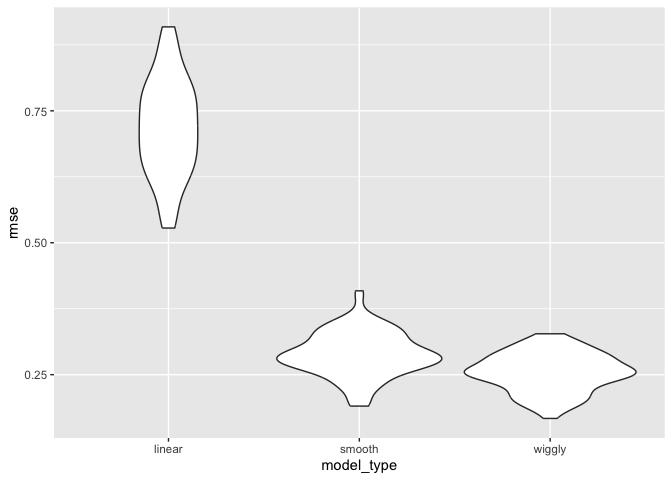

Cross validation
================
rl3411
2023-11-14

``` r
set.seed(1)
library(tidyverse)
```

    ## ── Attaching core tidyverse packages ──────────────────────── tidyverse 2.0.0 ──
    ## ✔ dplyr     1.1.3          ✔ readr     2.1.4     
    ## ✔ forcats   1.0.0          ✔ stringr   1.5.0     
    ## ✔ ggplot2   3.4.3          ✔ tibble    3.2.1.9006
    ## ✔ lubridate 1.9.2          ✔ tidyr     1.3.0     
    ## ✔ purrr     1.0.2          
    ## ── Conflicts ────────────────────────────────────────── tidyverse_conflicts() ──
    ## ✖ dplyr::filter() masks stats::filter()
    ## ✖ dplyr::lag()    masks stats::lag()
    ## ℹ Use the conflicted package (<http://conflicted.r-lib.org/>) to force all conflicts to become errors

``` r
library(modelr)
```

## Non-linear data and CV

``` r
nonlin_df = 
  tibble(
    id = 1:100, 
    x = runif(100,0,1),
    y = 1-10*(x-0.3)^2 + rnorm(100,0,0.3)
  )

nonlin_df |> 
  ggplot(aes(x = x, y = y)) + 
  geom_point()
```

<!-- -->

Do the train / test split

First do this by hand.

``` r
train_df = sample_n(nonlin_df, 80) |> 
  arrange(id)
test_df = anti_join(nonlin_df, train_df, by = "id")
```

``` r
train_df |> 
  ggplot(aes(x = x, y = y)) +
  geom_point() +
  geom_point(data = test_df, color = "red")
```

<!-- -->

``` r
linear_mod = lm(y ~ x, data = train_df)
```

Quick visualization of the linear model

``` r
train_df |> 
  modelr::add_predictions(linear_mod) |> 
  ggplot(aes(x = x, y = y)) +
  geom_point() + 
  geom_line(aes(y = pred))
```

<!-- -->

This is not a good model fit. Try the next one

``` r
smooth_mod = mgcv::gam(y ~ s(x), data = train_df)
```

``` r
train_df |> 
  modelr::add_predictions(smooth_mod) |> 
  ggplot(aes(x = x, y = y)) +
  geom_point() + 
  geom_line(aes(y = pred))
```

<!-- -->

Try the next one

``` r
wiggly_mod = mgcv::gam(y ~ s(x, k = 30), sp = 10e-6, data = train_df)
```

``` r
train_df |> 
  modelr::add_predictions(wiggly_mod) |> 
  ggplot(aes(x = x, y = y)) +
  geom_point() + 
  geom_line(aes(y = pred))
```

<!-- -->

``` r
# RMSE on training data
rmse(linear_mod, train_df)
```

    ## [1] 0.7178747

``` r
rmse(smooth_mod, train_df)
```

    ## [1] 0.2874834

``` r
rmse(wiggly_mod, train_df)
```

    ## [1] 0.2498309

``` r
# RMSE on testing data gives a sense of out-of-sample prediction accuracy
rmse(linear_mod, test_df)
```

    ## [1] 0.7052956

``` r
rmse(smooth_mod, test_df)
```

    ## [1] 0.2221774

``` r
rmse(wiggly_mod, test_df)
```

    ## [1] 0.289051

## Use modelr for CV

``` r
cv_df = 
  nonlin_df |> 
  crossv_mc(n = 100) |> 
  mutate(
    train = map(train, as_tibble),
    test = map(test, as_tibble)
  ) 
```

``` r
cv_df |> pull(train) |> nth(3) |> as_tibble()
```

    ## # A tibble: 79 × 3
    ##       id     x      y
    ##    <int> <dbl>  <dbl>
    ##  1     1 0.266  1.11 
    ##  2     2 0.372  0.764
    ##  3     3 0.573  0.358
    ##  4     4 0.908 -3.04 
    ##  5     5 0.202  1.33 
    ##  6     6 0.898 -1.99 
    ##  7     7 0.945 -3.27 
    ##  8    11 0.206  1.63 
    ##  9    12 0.177  0.836
    ## 10    13 0.687 -0.291
    ## # ℹ 69 more rows

Apply each model to all training datasets, and evaluate on all testing
datasets.

``` r
cv_results = 
  cv_df |> 
  mutate(
    linear_fit = map(train, \(df) lm(y ~ x, data = df))
  )

# This is the same as

lin_mod_funct = function(df) {
  lm(y~x, data = df)
}

# then

cv_results = 
  cv_df |> 
  mutate(
    linear_fit = map(train, lin_mod_funct)
  ) 
```

``` r
cv_results = 
  cv_df |> 
  mutate(
    linear_fit = map(train, \(df) lm(y ~ x, data = df)),
    smooth_fit = map(train, \(df) mgcv::gam(y ~ s(x), data = df)),
    wiggly_fit = map(train, \(df) mgcv::gam(y ~ s(x, k = 30), sp = 10e-6, data = train_df))
  ) |> 
  mutate(
    rmse_linear = map2_dbl(linear_fit, test, \(mod, df) rmse(mod, df)),
    rmse_smooth = map2_dbl(smooth_fit, test, \(mod, df) rmse(mod, df)),
    rmse_wiggly = map2_dbl(wiggly_fit, test, \(mod, df) rmse(mod, df))
  )
```

Tidy this dataset

``` r
cv_results |> 
  select(starts_with("rmse")) |> 
  pivot_longer(
    everything(),
    names_to = "model_type",
    values_to = "rmse",
    names_prefix = "rmse_"
  ) |> 
  group_by(model_type) |> 
  summarize(m_rmse = mean(rmse)) 
```

    ## # A tibble: 3 × 2
    ##   model_type m_rmse
    ##   <chr>       <dbl>
    ## 1 linear      0.718
    ## 2 smooth      0.289
    ## 3 wiggly      0.254

``` r
cv_results |> 
  select(starts_with("rmse")) |> 
  pivot_longer(
    everything(),
    names_to = "model_type",
    values_to = "rmse",
    names_prefix = "rmse_"
  ) |> 
  ggplot(aes(x = model_type, y = rmse)) +
  geom_violin()
```

<!-- -->
